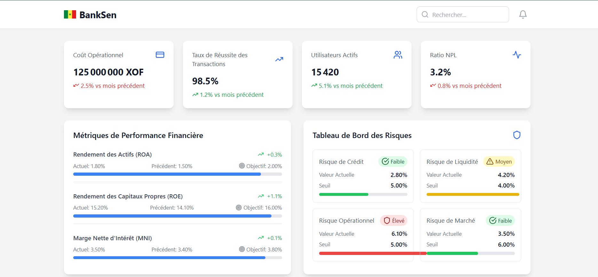

# Tableau de Bord Bancaire BankSen

Un tableau de bord moderne pour la gestion bancaire, conçu spécifiquement pour le contexte sénégalais.

## 🌟 Fonctionnalités

- 📊 Suivi en temps réel des métriques financières
- 💰 Gestion des transactions
- 🏦 Surveillance des performances des agences
- 📈 Analyse des risques
- 👥 Suivi des activités utilisateurs
- 💱 Support de la monnaie XOF

## 🚀 Technologies Utilisées

- React.js
- TypeScript
- Tailwind CSS
- SQL
- Recharts pour les graphiques
- Lucide React pour les icônes

## 📋 Prérequis

- Node.js (version 18 ou supérieure)
- npm ou yarn
- XAMPP

## 🛠️ Installation

1. Clonez le dépôt :
```bash
git clone [https://github.com/cheikht1/SENBANK.git]
```

2. Installez les dépendances :
```bash
npm install
```

3. Créez un fichier `.env` à la racine du projet et ajoutez vos variables d'environnement Firebase :
```env
DB_HOST=
DB_USER=
DB_PASSWORD=
DB_NAME=
PORT=3001
```

4. Lancez le serveur de développement :
```bash
npm run dev
```

## 📱 Captures d'écran

<div align="center">
  
   
  
</div>

## 🔧 Configuration

### 🗃️ Configuration de la Base de Données (MySQL)

1. **Installez XAMPP** :
   - Téléchargez et installez [XAMPP](https://www.apachefriends.org/fr/index.html)
   - Lancez les services Apache et MySQL via le panneau de contrôle

2. **Accédez à phpMyAdmin** :
   - Ouvrez `http://localhost/phpmyadmin` dans votre navigateur
   - Créez une nouvelle base de données (ex: `banksen_db`)

3. **Importez la structure** :
   - Utilisez le fichier SQL fourni dans `supabase\migrations\20250323173318_humble_pine.sql`

### Structure de la Base de Données

- `branches` : Informations sur les agences
- `transactions` : Historique des transactions
- `financial_metrics` : Métriques financières
- `risk_metrics` : Indicateurs de risque
- `user_activities` : Journal d'activités

## 🤝 Contribution

Les contributions sont les bienvenues ! N'hésitez pas à :

1. Fork le projet
2. Créer une branche (`git checkout -b feature/AmeliorationIncroyable`)
3. Commit vos changements (`git commit -m 'Ajout de quelque chose d'incroyable'`)
4. Push sur la branche (`git push origin feature/AmeliorationIncroyable`)
5. Ouvrir une Pull Request

## 📄 Licence

Ce projet est sous licence MIT. Voir le fichier `LICENSE` pour plus de détails.

## 📞 Contact

Pour toute question ou suggestion, n'hésitez pas à ouvrir une issue ou à nous contacter directement.

## 🌟 Remerciements

Ce projet open source est le fruit d'un travail solo, mais aucune création n'existe dans le vide. Je tiens à exprimer ma gratitude envers :

- **La communauté open source** - Pour toutes les ressources libres qui ont rendu ce projet possible  
- **Les contributeurs des librairies utilisées** (React, Tailwind, MySQL, etc.) - Votre travail invisible est vital  
- **Les futurs contributeurs** - Qui feront évoluer ce projet au-delà de ce que j'imagine  
- **Les utilisateurs/testeurs** - Vos feedbacks donneront vie à cet outil  

*"Seul on va plus vite, ensemble on va plus loin"* ❤️